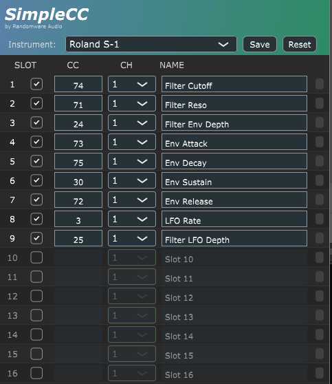

# SimpleCC

### MIDI CC Modulation VST3 Plugin

*By Randomware Audio*

## 🎯 Motivation

**SimpleCC** was created for DAWs that don't provide MIDI CC automation out of the box (like Bitwig Essentials). 
If your DAW limits your ability to automate hardware synthesizers or external MIDI gear, SimpleCC bridges that gap by giving you 16 modulation slots to send precise MIDI CC messages to your external instruments.

---

## 📥 Download

Download the latest version from the **[Releases page](https://github.com/phones24/SimpleCC/releases)**.

Available for **Linux**, **Windows**, and **macOS** (Intel & Apple Silicon) as VST3 plugin.

---

**Made with ❤️ by Randomware Audio**

